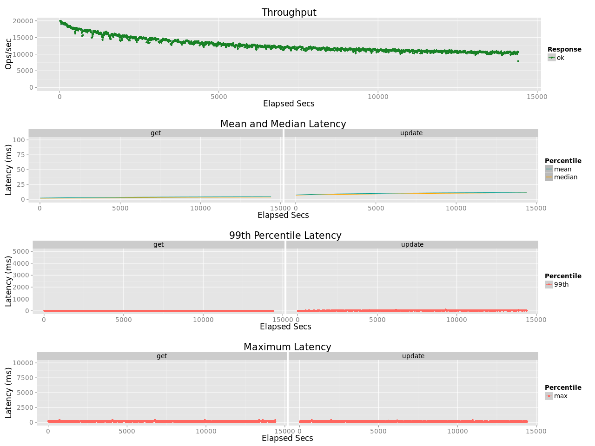
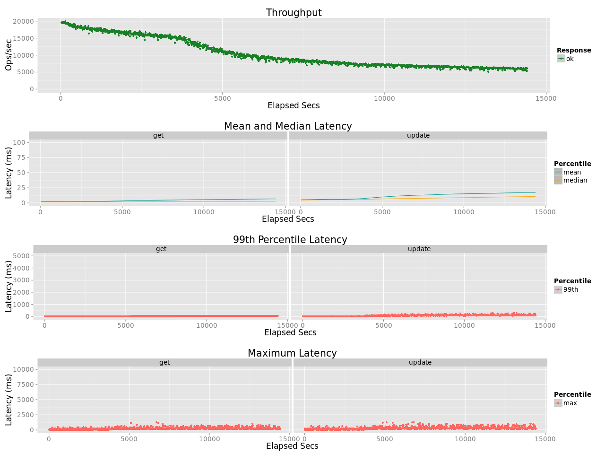
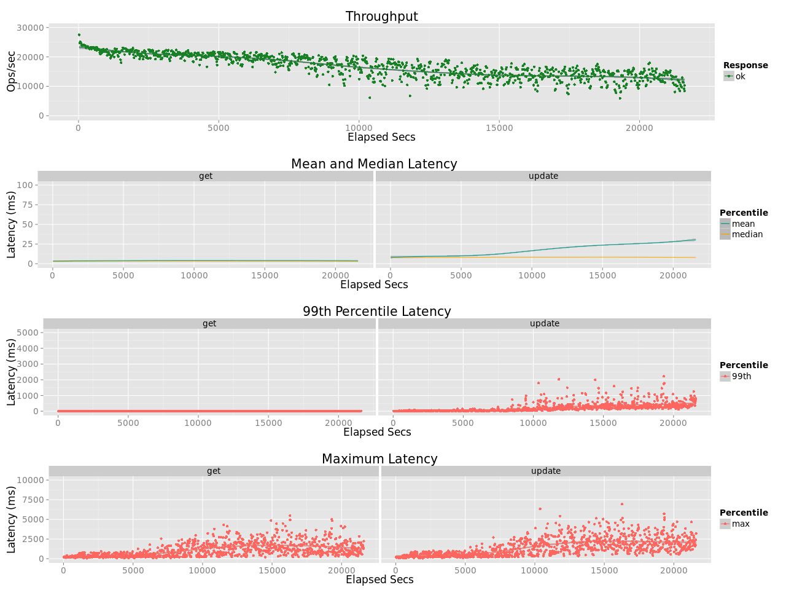

# Volume Testing

## Parallel Node Testing

Initial volume tests have been [based on standard basho_bench eleveldb test](../test/volume/single_node/examples) to run multiple stores in parallel on the same node and and subjecting them to concurrent pressure.

This showed a [relative positive performance for leveled](VOLUME_PRERIAK.md) for both population and load. This also showed that although the leveled throughput was relatively stable, it was still subject to fluctuations related to CPU constraints - especially as compaction of the ledger was a CPU intensive activity.  Prior to moving on to full Riak testing, a number of changes where then made to leveled to reduce the CPU load during these merge events.

## Initial Riak Cluster Tests

Testing in a Riak cluster, has been based on like-for-like comparisons between leveldb and leveled - except that leveled was run within a Riak [modified](FUTURE.md) to use HEAD not GET requests when HEAD requests are sufficient.  

The initial testing was based on simple gets and updates, with 5 gets for every update.  

### Basic Configuration - Initial Tests

The configuration consistent across all tests is:

- A 5 node cluster
- Using i2.2xlarge EC2 or d2.2xlarge nodes with mirrored/RAID10 drives (for data partition only)
- deadline scheduler, transparent huge pages disabled, ext4 partition
- A 64 partition ring-size
- AAE set to passive
- A pareto distribution of requests with a keyspace of 200M keys
- 5 GETs for each UPDATE

### Mid-Size Object, SSDs, Sync-On-Write

This test has the following specific characteristics

- An 8KB value size (based on crypto:rand_bytes/1 - so cannot be effectively compressed)
- 60 concurrent basho_bench workers running at 'max'
- i2.2xlarge instances
- allow_mult=false, lww=false
- <b>sync_on_write = on</b>

Comparison charts for this test:

Riak + leveled             |  Riak + eleveldb
:-------------------------:|:-------------------------:
  |  

### Mid-Size Object, SSDs, No Sync-On-Write

This test has the following specific characteristics

- An 8KB value size (based on crypto:rand_bytes/1 - so cannot be effectively compressed)
- 100 concurrent basho_bench workers running at 'max'
- i2.2xlarge instances
- allow_mult=false, lww=false
- <b>sync_on_write = off</b>

Comparison charts for this test:

Riak + leveled             |  Riak + eleveldb
:-------------------------:|:-------------------------:
  |  

### Mid-Size Object, HDDs, No Sync-On-Write

This test has the following specific characteristics

- An 8KB value size (based on crypto:rand_bytes/1 - so cannot be effectively compressed)
- 50 concurrent basho_bench workers running at 'max'
- <b>d2.2xlarge instances</b>
- allow_mult=false, lww=false
- sync_on_write = off

Comparison charts for this test:

Riak + leveled           |  Riak + eleveldb
:-------------------------:|:-------------------------:
  |  

Note that there is a clear inflexion point when throughput starts to drop sharply at about the hour mark into the test.  
This is the stage when the volume of data has begun to exceed the volume supportable in cache, and so disk activity begins to be required for GET operations with increasing frequency.

### Half-Size Object, SSDs, No Sync-On-Write

This test has the following specific characteristics

- A <b>4KB value size</b> (based on crypto:rand_bytes/1 - so cannot be effectively compressed)
- 100 concurrent basho_bench workers running at 'max'
- i2.2xlarge instances
- allow_mult=false, lww=false
- sync_on_write = off

Comparison charts for this test:

Riak + leveled           |  Riak + eleveldb
:-------------------------:|:-------------------------:
  |  

### Double-Size Object, SSDs, No Sync-On-Write

This test has the following specific characteristics

- A <b>16KB value size</b> (based on crypto:rand_bytes/1 - so cannot be effectively compressed)
- 60 concurrent basho_bench workers running at 'max'
- i2.2xlarge instances
- allow_mult=false, lww=false
- sync_on_write = off

Comparison charts for this test:

Riak + leveled           |  Riak + eleveldb
:-------------------------:|:-------------------------:
  |  

### Lies, damned lies etc

The first thing to note about the test is the impact of the pareto distribution and the start from an empty store, on what is actually being tested.  At the start of the test there is a 0% chance of a GET request actually finding an object.  Normally, it will be 3 hours into the test before a GET request will have a 50% chance of finding an object.

Both leveled and leveldb are optimised for finding non-presence through the use of bloom filters, so the comparison is not unduly influenced by this.  However, the workload at the end of the test is both more realistic (in that objects are found), and harder if the previous throughput had been greater (in that more objects are found).  

So it is better to focus on the results at the tail of the tests, as at the tail the results are a more genuine reflection of behaviour against the advertised test parameters.

Test Description                  | Hardware     | Duration |Avg TPS    | Delta (Overall)  | Delta (Last Hour)
:---------------------------------|:-------------|:--------:|----------:|-----------------:|-------------------:
8KB value, 60 workers, sync       | 5 x i2.2x    | 4 hr     | 12,679.91 | <b>+ 70.81%</b>  | <b>+ 63.99%</b>
8KB value, 100 workers, no_sync   | 5 x i2.2x    | 6 hr     | 14,100.19 | <b>+ 16.15%</b>  | <b>+ 35.92%</b>
8KB value, 50 workers, no_sync    | 5 x d2.2x    | 4 hr     | 10,400.29 | <b>+  8.37%</b>  | <b>+ 23.51%</b>
4KB value, 100 workers, no_sync   | 5 x i2.2x    | 6 hr     | 14,993.95 | - 10.44%  | - 4.48%
16KB value, 60 workers, no_sync   | 5 x i2.2x    | 6 hr     | 11,167.44 | <b>+ 80.48%</b>  | <b>+ 113.55%</b>

Leveled, like bitcask, will defer compaction work until a designated compaction window, and these tests were run outside of that compaction window.  So although the throughput of leveldb is lower, it has no deferred work at the end of the test.  Future testing work is scheduled to examine leveled throughput during a compaction window.  

As a general rule, looking at the resource utilisation during the tests, the following conclusions can be drawn:

- When unconstrained by disk I/O limits, leveldb can achieve a greater throughput rate than leveled.
- During these tests leveldb is frequently constrained by disk I/O limits, and the frequency with which it is constrained increases the longer the test is run for.
- leveled is almost always constrained by CPU, or by the limits imposed by response latency and the number of concurrent workers.
- Write amplification is the primary delta in disk contention between leveldb and leveled - as leveldb is amplifying the writing of values not just keys it is creating a significantly larger 'background noise' of disk activity, and that noise is sufficiently variable that it invokes response time volatility even when r and w values are less than n.
- leveled has substantially lower tail latency, especially on PUTs.
- leveled throughput would be increased by adding concurrent workers, and increasing the available CPU.
- leveldb throughput would be increased by having improved disk i/o.

## Riak Cluster Test - Phase 2

to be completed ..

Testing with changed hashtree logic in Riak so key/clock scan is effective

## Riak Cluster Test - Phase 3

to be completed ..

Testing during a journal compaction window

## Riak Cluster Test - Phase 4

Testing with secondary indexes provides some new challenges:

- Including index entries on updates accelerates the rate of compaction of the merge tree, as each update into the merge tree is now multiple changes;
- The 2i query needs an efficient snapshot to be taken of the store, and multiple such snapshots to exist in parallel;
- The coverage nature of the query means that the query operation is now as slow as the slowest of the vnodes (out of 22 nodes with a ring size of 64), rather than being as slow as the second slowest of three vnodes.  Coverage queries are reactive to local resource pressure, whereas standard GET flows can work around such pressure.

The secondary index test was built on a test which sent

- 100 GET requests;
- 10 update requests (i.e. GET then PUT) for 8KB fixed sized objects;
- 10 update requests (i.e. GET then PUT) for 8KB fixed sized objects with four index entries each (leading to 4 index changes for a new request, 8 index changes for an update request);
- 1 2i range query on the "date of birth" index with return_terms enabled;
- 1 2i range query on the "postcode index" with return_terms enabled.

The query load is relatively light compared to GET/PUT load in-line with Basho recommendations (decline from 350 queries per second to 120 queries per second through the test).  The queries
return o(1000) results maximum towards the tail of the test and o(1) results at the start of the test.

Riak + leveled           |  Riak + leveldb
:-------------------------:|:-------------------------:
  |  

The results are similar as to previous tests.  Although the test is on infrastructure with optimised disk throughput (and with no flushing to disk on write from Riak to minimise direct pressure from Riak), when running the tests with leveldb disk busyness rapidly becomes a constraining factor - and the reaction to that is volatility in throughput.  Riak combined with leveldb is capable in short bursts of greater throughput than Riak + leveled, however when throttled within the cluster by a node or nodes with busy disks, the reaction is extreme.

The average throughputs hour by hour are:

Hour      |Riak + leveled             |  Riak + leveldb           | Delta
:--------|-------------------------:|-------------------------:|--------
1 | 14,465.64 | 16,235.83 | - 10.90%
2 | 10,600.16 | 11,813.14 | - 10.27%
3 |  8,605.89 |  7,895.84 | <b>+ 18.63%</b>
4 |  9,366,19 |  7,225.25 | <b>+ 19.11%</b>
5 |  8,180.88 |  6,826.37 | <b>+ 19.84%</b>
6 |  7,916.19 |  6,469.73 | <b>+ 22.36%</b>

The point of inflection when leveled-backed Riak begins to out-perform leveledb-backed Riak is related to the total size of the database going beyond the size of the in-memory cache.  The need to go to disk for reads as well as writes amplifies the disk busyness problem associated with write amplification.

As before, increasing the available CPU will increase the potential throughput of a leveled-backed cluster.  Increasing the disk IOPS rate will increase the potential throughput of a leveldb-backed cluster.  Increasing object sizes, will extend the throughput advantage of leveled and decreasing sizes will improve the performance of leveldb.  Increasing the size of the database relative to cache may increase the throughput advantage of leveled - but this may not hold true for all work profiles (for example those frequently accessing recently updated objects).

In the 2i query test there is the same significant reduction in tail latency when comparing leveled with leveldb.  For the 2i queries there is also a significant reduction in mean latency - a <b> 57.96%</b> reduction over the course of the test.  However this reduction is not a sign that leveled can resolve 2i queries faster than leveldb - it is related to the problem of tail latency.  The minimum response time for a 2i query in leveldb drifts from 4ms to 14ms as the test progresses - whereas the minimum response time for Riak and leveled fluctuates from 5ms through to 20ms at the end of the test.  Outside of resource pressure leveldb will give a faster response - but resource pressure is much more likely with leveldb.

## Riak Cluster Test - Phase 5

For larger objects, it is interesting to compare performance with between Bitcask and leveled.  At the start of a pure push test it is not possible for leveled to operate at the same rate as bitcask - as bitcask is finding/updating pointer s through a NIF'd memory operation in C (whereas leveled needs to has two levels of indirect pointers which are being lazily persisted to disk).

However, as the test progresses, there should be an advantage in that leveled is not needing to read each object from disk N times on both PUT and GET - so as the scope of the database creeps beyond that covered by the page cache, and as the frequency of disk reads starts to create an I/O bottlneck then leveled throughput will become more competitive.

Here is a side-by-side on a standard Phase 1 test on i2, without sync, and with 60 threads and 16KB objects.

Riak + leveled           |  Riak + bitcask
:-------------------------:|:-------------------------:
  |  

In the first hour of the test, bitcask throughput is <b>39.13%</b> greater than leveled.  Over the whole test, the bitcask-backed cluster achieves <b>16.48%</b> more throughput than leveled, but in the last hour this advantage is just <b>0.34%</b>.

The results for bitcask look a bit weird and lumpy though, so perhaps there's something else going on here that's contributing to the gap closing.
