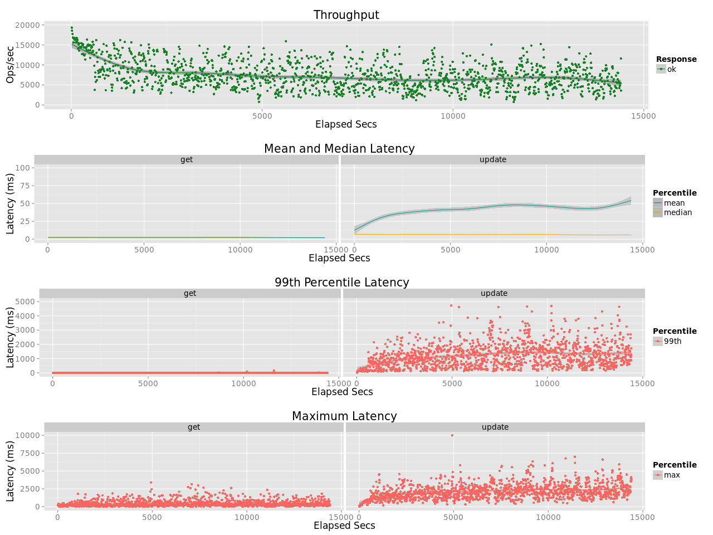
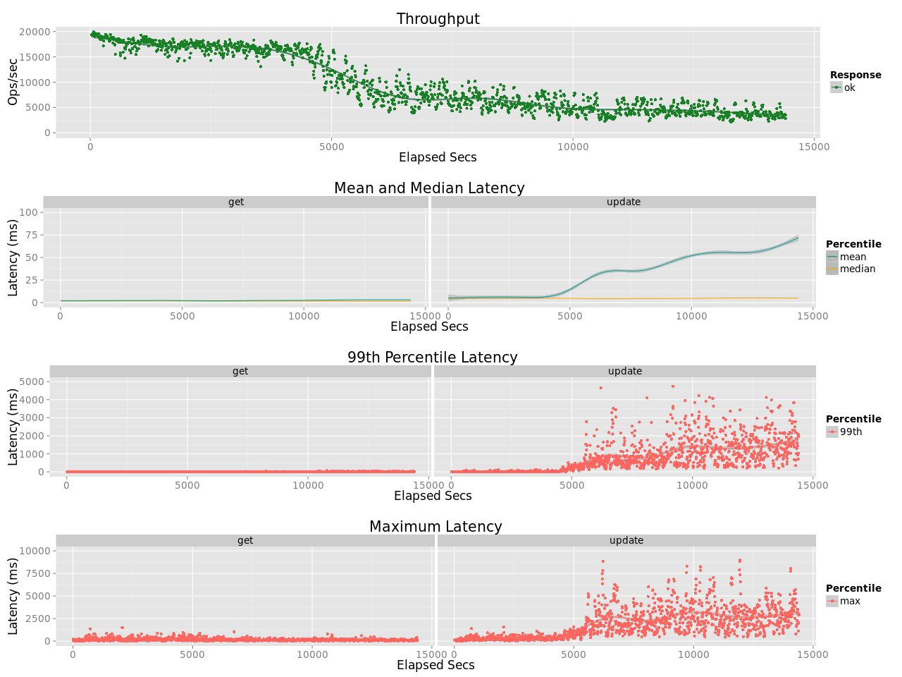
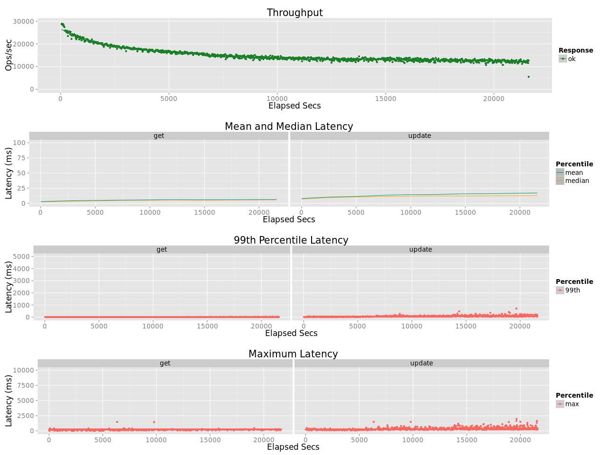
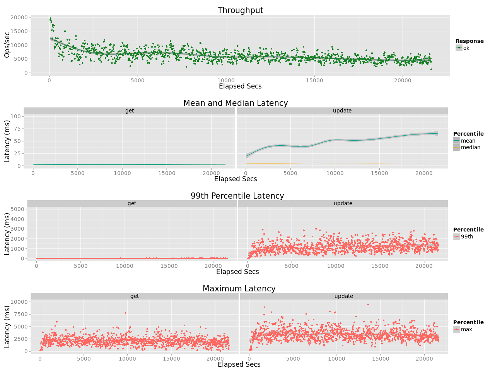

# Volume Testing

## Parallel Node Testing

Initial volume tests have been [based on standard basho_bench eleveldb test](../test/volume/single_node/examples) to run multiple stores in parallel on the same node and and subjecting them to concurrent pressure. 

This showed a [relative positive performance for leveled](VOLUME_PRERIAK.md) for both population and load. This also showed that although the leveled throughput was relatively stable, it was still subject to fluctuations related to CPU constraints - especially as compaction of the ledger was a CPU intensive activity.  Prior to moving on to full Riak testing, a number of changes where then made to leveled to reduce the CPU load during these merge events.

## Initial Riak Cluster Tests

Testing in a Riak cluster, has been based on like-for-like comparisons between leveldb and leveled - except that leveled was run within a Riak [modified](FUTURE.md) to use HEAD not GET requests when HEAD requests are sufficient.  

The initial testing was based on simple gets and updates, with 5 gets for every update.  

### Basic Configuration - Initial Tests

The configuration consistent across all tests is:

- A 5 node cluster
- Using i2.2xlarge EC2 or d2.2xlarge nodes with mirrored/RAID10 drives (for data partition only)
- deadline scheduler, transparent huge pages disabled, ext4 partition
- A 64 partition ring-size
- AAE set to passive
- A pareto distribution of requests with a keyspace of 200M keys
- 5 GETs for each UPDATE

### Mid-Size Object, SSDs, Sync-On-Write 

This test has the following specific characteristics

- An 8KB value size (based on crypto:rand_bytes/1 - so cannot be effectively compressed)
- 60 concurrent basho_bench workers running at 'max'
- i2.2xlarge instances
- allow_mult=false, lww=false
- <b>sync_on_write = on</b>

Comparison charts for this test:

Riak + leveled             |  Riak + eleveldb
:-------------------------:|:-------------------------:
  |  

### Mid-Size Object, SSDs, No Sync-On-Write 

This test has the following specific characteristics

- An 8KB value size (based on crypto:rand_bytes/1 - so cannot be effectively compressed)
- 100 concurrent basho_bench workers running at 'max'
- i2.2xlarge instances
- allow_mult=false, lww=false
- <b>sync_on_write = off</b>

Comparison charts for this test:

Riak + leveled             |  Riak + eleveldb
:-------------------------:|:-------------------------:
  |  

### Mid-Size Object, HDDs, No Sync-On-Write 

This test has the following specific characteristics

- An 8KB value size (based on crypto:rand_bytes/1 - so cannot be effectively compressed)
- 50 concurrent basho_bench workers running at 'max'
- <b>d2.2xlarge instances</b>
- allow_mult=false, lww=false
- sync_on_write = off

Comparison charts for this test:

Riak + leveled           |  Riak + eleveldb
:-------------------------:|:-------------------------:
  |  

Note that there is a clear inflexion point when throughput starts to drop sharply at about the hour mark into the test.  
This is the stage when the volume of data has begun to exceed the volume supportable in cache, and so disk activity begins to be required for GET operations with increasing frequency.

### Half-Size Object, SSDs, No Sync-On-Write 

This test has the following specific characteristics

- A <b>4KB value size</b> (based on crypto:rand_bytes/1 - so cannot be effectively compressed)
- 100 concurrent basho_bench workers running at 'max'
- i2.2xlarge instances
- allow_mult=false, lww=false
- sync_on_write = off

Comparison charts for this test:

Riak + leveled           |  Riak + eleveldb
:-------------------------:|:-------------------------:
  |  

### Double-Size Object, SSDs, No Sync-On-Write 

This test has the following specific characteristics

- A <b>16KB value size</b> (based on crypto:rand_bytes/1 - so cannot be effectively compressed)
- 60 concurrent basho_bench workers running at 'max'
- i2.2xlarge instances
- allow_mult=false, lww=false
- sync_on_write = off

Comparison charts for this test:

Riak + leveled           |  Riak + eleveldb
:-------------------------:|:-------------------------:
  |  

### Lies, damned lies etc

The first thing to note about the test is the impact of the pareto distribution and the start from an empty store, on what is actually being tested.  At the start of the test there is a 0% chance of a GET request actually finding an object.  Normally, it will be 3 hours into the test before a GET request will have a 50% chance of finding an object.

Both leveled and leveldb are optimised for finding non-presence through the use of bloom filters, so the comparison is not unduly influenced by this.  However, the workload at the end of the test is both more realistic (in that objects are found), and harder if the previous throughput had been greater (in that more objects are found).  

So it is better to focus on the results at the tail of the tests, as at the tail the results are a more genuine reflection of behaviour against the advertised test parameters.

Test Description                  | Hardware     | Duration |Avg TPS    | Delta (Overall)  | Delta (Last Hour)
:---------------------------------|:-------------|:--------:|----------:|-----------------:|-------------------:
8KB value, 60 workers, sync       | 5 x i2.2x    | 4 hr     | 12,679.91 | <b>+ 70.81%</b>  | <b>+ 63.99%</b>
8KB value, 100 workers, no_sync   | 5 x i2.2x    | 6 hr     | 14,100.19 | <b>+ 16.15%</b>  | <b>+ 35.92%</b>
8KB value, 50 workers, no_sync    | 5 x d2.2x    | 4 hr     | 10,400.29 | <b>+  8.37%</b>  | <b>+ 23.51%</b> 
4KB value, 100 workers, no_sync   | 5 x i2.2x    | 6 hr     | 14,993.95 | - 10.44%  | - 4.48%
16KB value, 60 workers, no_sync   | 5 x i2.2x    | 6 hr     | 11,167.44 | <b>+ 80.48%</b>  | <b>+ 113.55%</b>

Leveled, like bitcask, will defer compaction work until a designated compaction window, and these tests were run outside of that compaction window.  So although the throughput of leveldb is lower, it has no deferred work at the end of the test.  Future testing work is scheduled to examine leveled throughput during a compaction window.  

As a general rule, looking at the resource utilisation during the tests, the following conclusions can be drawn:

- When unconstrained by disk I/O limits, leveldb can achieve a greater throughput rate than leveled.
- During these tests leveldb is frequently constrained by disk I/O limits, and the frequency with which it is constrained increases the longer the test is run for.
- leveled is almost always constrained by CPU, or by the limits imposed by response latency and the number of concurrent workers.
- Write amplification is the primary delta in disk contention between leveldb and leveled - as leveldb is amplifying the writing of values not just keys it is creating a significantly larger 'background noise' of disk activity, and that noise is sufficiently variable that it invokes response time volatility even when r and w values are less than n.
- leveled has substantially lower tail latency, especially on PUTs.
- leveled throughput would be increased by adding concurrent workers, and increasing the available CPU.
- leveldb throughput would be increased by having improved disk i/o. 

## Riak Cluster Test - Phase 2

to be completed ..

Testing with changed hashtree logic in Riak so key/clock scan is effective

## Riak Cluster Test - Phase 3

to be completed ..

Testing during a journal compaction window

## Riak Cluster Test - Phase 4

to be completed ..

Testing for load including 2i queries

## Riak Cluster Test - Phase 5

For larger objects, it is interesting to compare performance with between Bitcask and leveled.  At the start of a pure push test it is not possible for leveled to operate at the same rate as bitcask - as bitcask is finding/updating pointer s through a NIF'd memory operation in C (whereas leveled needs to has two levels of indirect pointers which are being lazily persisted to disk).

However, as the test progresses, there should be an advantage in that leveled is not needing to read each object from disk N times on both PUT and GET - so as the scope of the database creeps beyond that covered by the page cache, and as the frequency of disk reads starts to create an I/O bottlneck then leveled throughput will become more competitive.

Here is a side-by-side on a standard Phase 1 test on i2, without sync, and with 60 threads and 16KB objects.

Riak + leveled           |  Riak + bitcask
:-------------------------:|:-------------------------:
  |  

Over the whole test, the bitcask-backed cluster achieves <b>16.48%</b> more throughput than leveled, but in the last hour this advantage is just <b>0.34%</b>.
