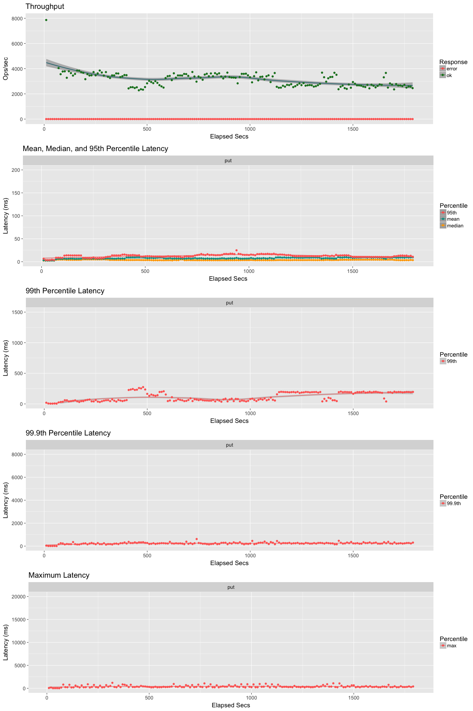

# Volume Testing

## Parallel Node Testing

Initial volume tests have been [based on standard basho_bench eleveldb test](../test/volume/single_node/examples) to run multiple stores in parallel on the same node and and subjecting them to concurrent pressure. 

This showed a relative positive performance for leveled for both population and load.

Populate leveled           |  Populate eleveldb
:-------------------------:|:-------------------------:
  |  

Load leveled             |  Load eleveldb
:-------------------------:|:-------------------------:
  |  

This test was a positive comparison for LevelEd, but also showed that although the LevelEd throughput was relatively stable it was still subject to fluctuations related to CPU constraints.  Prior to moving on to full Riak testing, a number of changes where then made to LevelEd to reduce the CPU load in particular during merge events.

The eleveldb results may not be a fair representation of performance in that:

- Within Riak it was to be expected that eleveldb would start with an appropriate default configuration that might better utilise available memory.
- The test node use had a single desktop (SSD-based) drive, and the the 'low' points of eleveldb performance were associated with disk constraints.  Running on more genuine servers with high-performance disks may give better performance.
